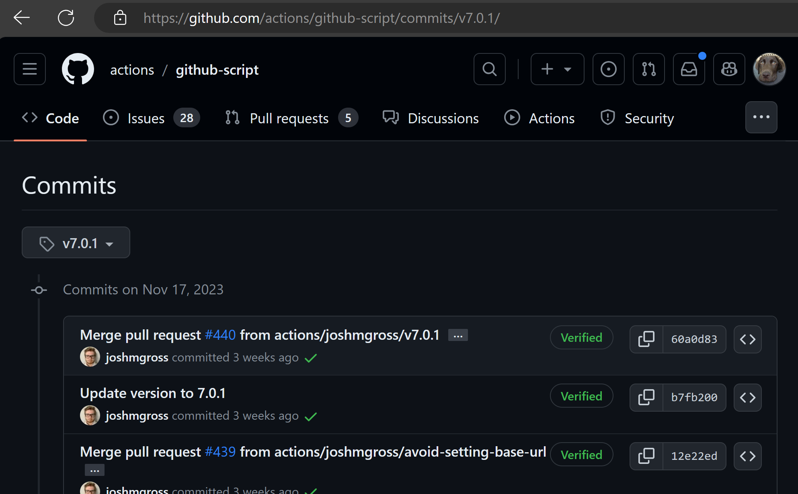

# Lab 2: CI workflow for the application in this repository
In this lab you create continuous integration (CI) workflow for the application in this repository. The workflow will run on every push to the `main` branch.

## 1. Create a workflow file that executes a CI build
A CI build is a build that runs on every push to a branch. Building the application prevents issues from being merged into the `main` branch that would break the application. The build validates that all changes have been added to the branch. This way there should be less issues where you go "it works on my machine" 😁.

1. Create a new file in the `.github/workflows` folder called `ci.yml`.
1. Execute `npm run build` and `npm run test` in the workflow.

> [!IMPORTANT]
> The goal is to have a successful build, that runs on every push to the any branch. It executes a build and runs the tests. When the build or test fails, the workflow should fail as well.

# Implement best practices for GitHub Actions
* Use a SHA hash instead of branch name or version tag
* Implement caching for the node_modules folder
* Use a matrix to run the build on multiple versions of node.js
* Specify the version of the node.js runtime

# 2. Use a SHA hash instead of branch name or version tag
Instead of using a version tag or branch name, use a SHA hash. This ensures that the workflow always uses the same version of the code. 

When using a branch name or version tag, the workflow will use the latest version of the branch or tag. This can lead to unexpected behavior when the branch or tag is updated.

> Note, you can load the SHA hash for an action by:
> - Going to the version tag (that you validated and checked for security issues). 
> - Click on the tag to go to the commit page.
> - Click on "commits" to go to the commit history.
> - Click on the copy button next to the commit hash you want to use
>
> Do note that you need to use the full SHA hash, not the abbreviated version.



You can also use a tool like [app.stepsecurity.io](https://app.stepsecurity.io/) that will do the conversion for you (and extra security measures as well). You onle need to change on `Pin Actions to a full length commit SHA` for this change.

You can also add SHA hash and then the version number as a tag so that the user can easily see which version of the action is used. This will look like this:

```yaml
uses: actions/checkout@1234567890123456789012345678901234567890 #v2.1.45
```

> Success criteria
> The goal is to have a successful build, that runs on every push to the branch, using the pinned sha hash instead of the version number.

# 3. Implement caching for the node_modules folder
The node_modules folder contains all the dependencies for the application. This folder can be quite large and it takes a while to download all the dependencies. You can speed up the workflow by caching the node_modules folder using the `actions/cache` action created by GitHub. That way the workflow can use the cached version instead of downloading all the dependencies again. The data in the cache is downloaded in one stream, instead of all the separate calls to the npm registry.

Use the hash of the package-lock.json file as the key for the cache. This ensures that the cache is invalidated when the dependencies change.

> [!IMPORTANT]
> The goal is to have a successful build, and the workflow should use the cached version of the node_modules folder. Notice the difference in the time it takes to download the dependencies vs downloading the cached files. Caching ha

# 4. Use a matrix to run the build on multiple versions of node.js
The application supports multiple versions of node.js. You can use a matrix to run the build on multiple versions of node.js with the same job definition. This ensures that the application works on all supported versions of node.js. Implement a matrix that runs the build on the following versions of node.js: 16, 18, 20.

> [!IMPORTANT]
> The goal is to have a successful build, and the workflow should run the build and tests on multiple versions of node.js. 

# 5. Specify the version of the node.js runtime
The node.js runtime is used to execute the build and test scripts. You can specify the version of the node.js runtime by using the `setup-node` action created by GitHub. This ensures that the workflow uses the same version of the node.js runtime every time, instead of hoping the correct version is installed on the runner.

> [!IMPORTANT]
> The goal is to have a successful build, and the workflow should use the `actions/setup-node` action with a specifc version of the node.js runtime. Recently GitHub added the caching mechanisme by default to the setup-* actions, so it does the same thing as the `actions/cache` action can achieve. This means that you could remove the `actions/cache` action from the workflow as it is no longer needed.